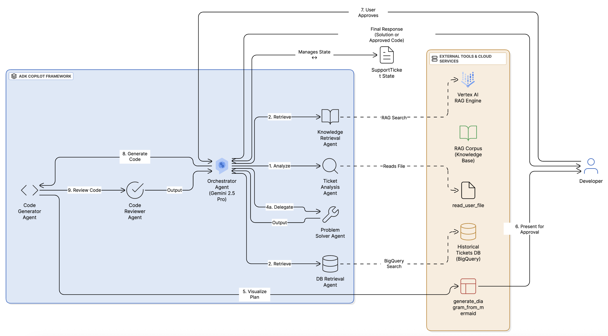

# ADK Copilot: A Reusable Framework for Autonomous AI Teams

> ### Built for ADK Developers, by an ADK-powered AI Team.


This project showcases a powerful, reusable framework built with the **Google Agent Development Kit (ADK)** to architect and orchestrate sophisticated teams of AI specialists that can automate complex, end-to-end workflows.

The primary implementation, **ADK Copilot**, demonstrates this by automating the entire software development lifecycle—from understanding a user's request, to designing a plan, generating code, visualizing the architecture, and performing an automated code review.

This is not just a chatbot. It is a blueprint for building autonomous, collaborative AI systems.

**➡️ Watch the Demo Video Here: [Link to YouTube/Vimeo]**

---


_The new architecture: An ADK Orchestrator managing a full development lifecycle with a code review loop._

## The ADK Copilot: An Example in Action

The best way to understand the framework is to see it work. The pre-configured ADK Copilot is designed to automate the complex process of developer support with an entire AI team.

### Meet the AI Team
The orchestrator manages a team of six highly specialized agents:

*   **`ticket_analysis_agent` (The Analyst):** Performs triage on user requests, with the ability to read linked files from GCS for deeper context.
*   **`knowledge_retrieval_agent` (The Librarian):** Searches the official ADK documentation using the **Vertex AI RAG Engine**.
*   **`db_retrieval_agent` (The Veteran):** Recalls historical solutions from a **BigQuery** database using vector search.
*   **`code_generator_agent` (The Engineer):** Designs a plan, visualizes it, and generates multi-file ADK agent code.
*   **`code_reviewer_agent` (The QA Lead):** Automatically reviews generated code for quality and correctness.
*   **`problem_solver_agent` (The Synthesizer):** Provides step-by-step solutions for non-code-related issues.

### Example Interaction
Here's a walkthrough of the new, end-to-end code generation workflow:

> **User:** Write me an agent that uses an external API to get the current price of Bitcoin.

> **Agent:** Thank you for your request... I've found some relevant information. I am now ready to formulate a plan. Shall I proceed?

> **User:** Yes, please.

> **Agent:** Excellent. Here is the proposed architecture for your `CryptoPriceAgent`. I will create a main agent that uses a custom tool to call the CoinDesk API. This will require the `requests` library. Does this plan look good?
>
> **[A PNG image of the architecture diagram is displayed here]**

> **User:** The plan and diagram look perfect. Go ahead and build it.

> **Agent:** Great. I will now generate the complete code and pass it for a final quality check.
>
> *Behind the scenes, the Engineer generates the code. The QA Lead then reviews it against the style guide and approves it.*
>
> **Agent:** The code has been generated and has passed all quality checks. Here is the complete, multi-file agent:
>
> `==== FILE: crypto_price_agent/agent.py ====`
> ... (and so on)

## The Core Idea: A Framework for AI Teams

The goal of this project was to move beyond simple "copilots" and build a system that mimics a real, high-functioning software development team. This framework uses the **Google Agent Development Kit** to create a central `orchestrator_agent` that manages a stateful workflow across a team of swappable, specialist sub-agents.

The heavy lifting—the interactive state machine, the parallel data retrieval, the dynamic diagram generation, the automated quality assurance, and the cloud infrastructure setup—is already done.

## Key Architectural Pillars & Features

I designed the framework around four core pillars that make it a robust and production-ready system.

#### 1. Build Reliable Workflows with a State Machine
Reliability is everything. The orchestrator is a strict state machine governed by its ADK prompt. It moves tasks through a granular lifecycle (`New` -> `Analyzing` -> `AwaitingConfirmation` -> `Generating` -> `Reviewing`). Crucially, it communicates its progress and **waits for user approval** at key checkpoints, creating a collaborative and controllable workflow.

#### 2. Understand Deeper with Multi-Modal Input
The `ticket_analysis_agent` can understand more than just text. Users can provide a link to a log file or code file in **Google Cloud Storage** (`gs://...`). The agent uses a tool to read the file's content, incorporating it into its analysis for a much deeper understanding of the user's problem.

#### 3. Communicate Visually with Dynamic Diagrams
A good developer team communicates its plan visually. When asked to generate code, the `code_generator_agent` first outputs a textual plan *and* **Mermaid syntax** for an architecture diagram. A custom tool then uses Playwright to render this syntax into a PNG, which is shown to the user. This "show, don't just tell" approach is a core feature.

#### 4. Guarantee Quality with an Automated Code Reviewer
Generated code is not trusted blindly. After the `code_generator_agent` writes the code, it is immediately passed to a dedicated `code_reviewer_agent`. This QA agent analyzes the code against a formal **style guide**, checking for correctness, security, and best practices, ensuring a high-quality output every time.

## Getting Started

#### Setup and Installation
1.  **Prerequisites:** Python 3.11+, Poetry, and an authenticated Google Cloud SDK.
2.  **Configure:** Copy `.env.example` to `.env` and fill in your GCP `project-id` and a unique `bucket-name`.
3.  **Install:** Run `poetry install`.
4.  **Build Backend:** Run `./setup_environment.sh` to provision all cloud resources.

#### Running the Agent
Start the local web interface with `adk web` and select `adk_copilot`.

## Customizing the Framework
This project's greatest strength is its adaptability. To create your own specialized assistant:

1.  **Provide New Knowledge:** Replace the files in `data/knowledge_base` and update the data generation script in `scripts/create_mock_db.py`.
2.  **Define New Specialists:** Edit the prompts in `adk_copilot/sub_agents/` to change agent expertise and behavior.
3.  **Run the Setup Script:** Execute `./setup_environment.sh` to build a new cloud backend for your custom agent.

## Testing and Deployment

*   **Evaluation:** Run `poetry run pytest eval`.
*   **Deployment:** Use the scripts in the `deployment/` directory to deploy to **Google Cloud Run** or the **Vertex AI Agent Engine**. See `deployment/README.md`.

## Repository Structure

The repository is organized to separate core logic from data, scripts, and deployment configurations.

```
mohitbhimrajka-adk-copilot/
├── adk_copilot/
│   ├── agent.py         # Main orchestrator agent.
│   ├── prompts.py       # Centralized prompts for all agents.
│   ├── entities/        # Pydantic data models (SupportTicket).
│   ├── sub_agents/      # The six specialist agents (Analyst, Librarian, etc.).
│   └── tools/           # Custom tools (BigQuery search, diagram gen, etc.).
├── data/
│   ├── knowledge_base/  # Documents for the Vertex AI RAG Corpus.
│   └── resolved_tickets.csv # Data for the BigQuery database.
├── scripts/             # Automation scripts for setup and data prep.
├── deployment/          # Deployment scripts for Cloud Run & Agent Engine.
├── eval/                # Evaluation suite for testing agent performance.
├── setup_environment.sh # The master script for one-command setup.
└── README.md            # This file.
```

## Disclaimer

This project was developed for the Google ADK Hackathon. It is provided for illustrative purposes and is not intended for production use without further testing and hardening.