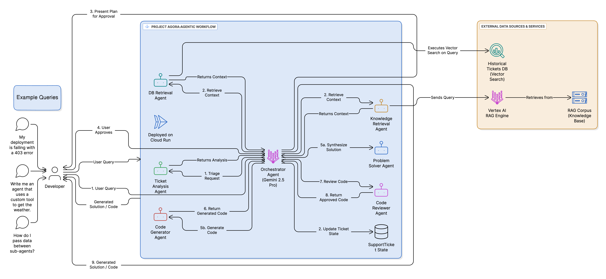

# Project Agora: An Agentic Expert System for the ADK

> #### A hierarchical multi-agent framework built with the Google Agent Development Kit, pre-configured to automate complex ADK development workflows.


[](https://github.com/MohitBhimrajka/project-agora)

**Project Agora is a multi-agent AI system designed to act as an expert on the Google Agent Development Kit (ADK). It can answer complex technical questions, generate complete, multi-file agent applications from a single prompt, and design system architectures on the fly.**

This repository serves two primary goals:

1. **A Powerful, Live Application**: To provide developers with a ready-to-use, intelligent assistant that dramatically accelerates ADK development and troubleshooting.

2. **A Reusable Framework**: To offer a robust architectural blueprint for building other stateful, collaborative agentic systems for any domain.

## Why Agora?
In ancient Greece, the Agora was the central public square—a hub of assembly, dialogue, and commerce where specialized craftsmen and thinkers came together. This framework provides a digital Agora: a central orchestration hub where specialized AI agents assemble to collaborate, reason, and execute complex tasks.

---

## TL;DR: Quickstart

For experienced developers who want to get running immediately:

```bash
# 1. Clone the repository
git clone https://github.com/MohitBhimrajka/project-agora.git
cd project-agora

# 2. Configure your environment
cp .env.example .env
# --> EDIT .env and set your GCP_PROJECT_ID and a unique BUCKET_NAME <--

# 3. Install dependencies
poetry install

# 4. Provision the cloud backend (this will take several minutes)
./setup_environment.sh

# 5. Run the agent
adk web # And select 'project_agora' from the dropdown
```


_The architecture: A root agent orchestrating specialized sub-agents via the AgentTool class._

---

## The Pre-Configured Use Case: An ADK Specialist System

Navigating a new SDK, understanding its best practices, and scaffolding new projects can be time-consuming. Project Agora is configured as an expert assistant that automates this entire process.

With this system, a developer can:

- **Ask complex questions** about ADK features, deployment, or state management and receive synthesized answers grounded in both official documentation and a historical database of solved problems.

- **Generate full ADK projects** from a single-sentence prompt. The system will design the architecture, request user approval with a visual diagram, write the code, and perform a quality check.

- **Visualize Architectures** before committing to code, ensuring the agent's plan aligns with the developer's intent.

## How It Works: The Agent Hierarchy

To achieve this, the root `orchestrator_agent` manages a set of six specialized sub-agents, each exposed as an `AgentTool`:

- **`ticket_analysis_agent` (The Triage Agent)**: Classifies the user's request and can read contextual data from files in Google Cloud Storage (`gs://...`).

- **`knowledge_retrieval_agent` (The RAG Agent)**: Executes queries against the official ADK documentation using the ADK's built-in `VertexAiRagRetrieval` tool.

- **`db_retrieval_agent` (The Vector Search Agent)**: Recalls historical solutions by executing a `COSINE_DISTANCE` vector search against a BigQuery table.

- **`code_generator_agent` (The Code Generation Agent)**: Designs a plan, visualizes it with a Mermaid diagram, and generates complete, multi-file ADK agent code.

- **`code_reviewer_agent` (The QA Agent)**: A dedicated agent that programmatically reviews generated code against a formal style guide.

- **`problem_solver_agent` (The Synthesis Agent)**: A stateless `LlmAgent` that synthesizes context to formulate step-by-step text solutions.

---

## The Core Architectural Pattern (The Framework)

This framework implements a **hierarchical agent topology**. It uses the Google ADK to create a central `orchestrator_agent` that directs a stateful workflow across a set of swappable, specialized sub-agents. Each sub-agent is wrapped in an `AgentTool`, allowing the orchestrator to invoke them just like any other tool.

The framework handles the complex implementation details: the stateful inference chain, parallel tool execution, dynamic diagram generation, an automated QA review loop, and the declarative cloud infrastructure setup.

## Key Technical Features

The framework is built on four pillars that ensure robustness and production-readiness.

### 1. Prompt-Defined State Machine for Reliability

The orchestrator's behavior is governed by a strict state machine defined within its instruction prompt. It moves tasks through a granular lifecycle (`New` -> `Analyzing` -> `AwaitingConfirmation`). Critically, the prompt instructs the agent to **wait for explicit user confirmation** at key transition points, creating a controllable and auditable inference chain.

### 2. Contextual Grounding with Multi-Modal Input

The `ticket_analysis_agent` can ground its analysis on more than just text. By using a custom tool (`read_user_file`), it can ingest the content of log files or code files provided by the user via a Google Cloud Storage URI, enabling a deeper understanding of the problem space.

### 3. Visual Execution Plans with Dynamic Diagrams

The system communicates its execution plan visually. The `code_generator_agent` first outputs a plan and Mermaid syntax for an architecture diagram. A custom tool then renders this into a PNG and returns a public URL. This "show, don't just tell" approach provides transparency into the agent's reasoning process.

### 4. Automated Quality Gates with a Reviewer Agent

To ensure output quality, generated code is not trusted implicitly. After the `code_generator_agent` writes the code, it is immediately passed to the dedicated `code_reviewer_agent`. This QA agent programmatically analyzes the code against a formal style guide, ensuring correctness and adherence to best practices.

---

## Getting Started & Customization

### Prerequisites

- **Python 3.11+**
- **Poetry** for dependency management
- An authenticated **Google Cloud SDK** (`gcloud auth application-default login`)

### Step-by-Step Setup

**1. Clone and Configure:**
```bash
git clone https://github.com/MohitBhimrajka/project-agora.git
cd project-agora
cp .env.example .env
```

**2. Edit `.env`** and set your required values:
- `GOOGLE_CLOUD_PROJECT`: Your Google Cloud Project ID
- `GOOGLE_CLOUD_STORAGE_BUCKET`: A globally unique name for a new GCS bucket
- `BQ_PROJECT_ID`: Set this to your Google Cloud Project ID

**3. Install and Provision:**
```bash
poetry install
./setup_environment.sh  # Creates GCS bucket, BigQuery dataset, and Vertex AI RAG Corpus
```

**4. Run the Agent:**
```bash
adk web  # Select 'project_agora' from the dropdown
```

### Customizing the Framework

This project's adaptability is its greatest strength. To create your own specialized agentic workflow:

1. **Provide a New Knowledge Base**: Replace the files in `data/knowledge_base` and update the mock data generation in `scripts/create_mock_db.py`.

2. **Define New Sub-Agents**: Edit the prompts and tools in `project_agora/sub_agents/` to change agent capabilities and behavior.

3. **Run the Setup Script**: Execute `./setup_environment.sh` to provision a new cloud backend for your custom system.

---

## Testing and Deployment

- **Evaluation**: Run `poetry run pytest eval`
- **Deployment**: Use the scripts in the `deployment/` directory to deploy to **Google Cloud Run** or the **Vertex AI Agent Engine**. See `deployment/README.md`

## Repository Structure

The repository is organized to separate core agent logic from data, scripts, and deployment configurations.

```
project-agora/
├── project_agora/           # Core application source code
│   ├── agent.py             # Root orchestrator agent
│   ├── sub_agents/          # Specialized sub-agents
│   └── tools/               # Custom tools
├── data/                    # Knowledge base and sample data
├── deployment/              # Scripts for Cloud Run & Agent Engine deployment
├── eval/                    # Evaluation suite and test data
├── scripts/                 # Setup and automation scripts
├── cleanup.sh               # Reverses the setup script
└── README.md                # This file
```

## Roadmap

This framework is a living project with exciting enhancements planned for the future:

### Long-term Aspirations
- [ ] **GitHub Tool Integration**: Comprehensive GitHub integration for automated code reviews, issue management, and CI/CD pipeline orchestration
- [ ] **Federated Agent Topologies**: Support for distributed agent systems across multiple cloud environments
- [ ] **Industry-Specific Implementations**: Pre-configured agent hierarchies for specific domains (healthcare, finance, legal, etc.)

### Community Contributions Welcome
We're particularly interested in contributions that:
- Add new specialized sub-agents for different domains
- Improve the reliability and robustness of existing custom tools
- Enhance the developer experience with better debugging and monitoring
- Expand integration capabilities with popular enterprise tools

See our [Contributing Guide](CONTRIBUTING.md) for details on how to get involved!

## Disclaimer

This project was developed for the Google ADK Hackathon. It is provided as a reference implementation and is not intended for production use without further testing and hardening.