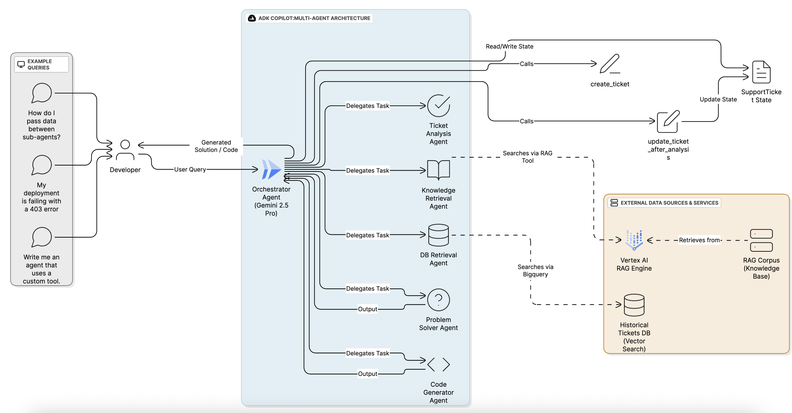

# ADK Copilot: A Reusable Framework for Multi-Agent AI

> ### Built for ADK Developers, by an ADK-powered AI Team


This project began with a simple goal: to build a tool that could solve my own challenges while learning the new Google Agent Development Kit. It evolved into something much bigger: a powerful, reusable framework for building and orchestrating sophisticated teams of AI specialists.

This repository provides two key things:
1.  **A ready-to-run AI assistant, "ADK Copilot,"** which serves as an expert on the ADK itself.
2.  **A domain-agnostic framework** that you can adapt to create your own AI assistant for any field, built on the robust orchestration capabilities of the Google ADK.

<!-- **➡️ Watch the Demo Video Here: [Link to YouTube/Vimeo]** -->

---


_The high-level architecture: A central ADK Orchestrator managing a team of specialist agents._

## The Core Idea: A Framework for AI Teams

A truly helpful AI assistant needs to do more than just search documents. It must analyze problems, recall past experiences, synthesize solutions, and create new things. This requires a team.

This framework provides the blueprint for that team. It uses the **Google Agent Development Kit** to create a central `orchestrator_agent` that manages a workflow across a team of swappable, specialist sub-agents. The heavy lifting—the stateful orchestration, the parallel data retrieval, the error handling—is already done. You just need to define your team's expertise.

## Key Architectural Pillars

I designed the framework around three core pillars to make it powerful, reliable, and easy to use.

#### 1. Stateful Orchestration with ADK
Reliability is everything. The orchestrator is not a free-thinking LLM; it's a strict state machine governed by its ADK prompt. It manages a `SupportTicket` state object, moving a task predictably through stages like `New` -> `Analyzing` -> `Pending Solution`. This makes the entire system robust and debuggable.

#### 2. Dual-Source Knowledge with Vertex AI & BigQuery
An expert has both "book smarts" and "street smarts." This framework gives that to your agents.
*   **Book Smarts (The Librarian):** An ADK agent wields the **Vertex AI RAG Engine**, allowing it to perform true semantic search across a vast corpus of your unstructured documents.
*   **Street Smarts (The Veteran):** Another ADK agent connects to **BigQuery**, using its native **vector search** to find solutions from a historical database of past problems, giving the system a powerful, experience-based memory.

#### 3. One-Command Cloud Setup
A powerful tool that's hard to set up will never get used. I invested heavily in a master `setup_environment.sh` script that automates the entire Google Cloud backend. It provisions GCS buckets, creates and populates **BigQuery** tables, and builds your **Vertex AI RAG Corpus** with a single command, saving hours of manual configuration.

## The ADK Copilot: An Example in Action

The best way to understand the framework is to run the pre-configured ADK Copilot. This implementation is designed to automate the complex process of developer support.

### The Specialist AI Team
The orchestrator manages a team of five highly specialized agents:

*   **`ticket_analysis_agent` (The Analyst):** The first point of contact. It performs triage on a raw user query, analyzing its intent and structuring it into a formal "ticket" with a category, urgency, and summary.
*   **`knowledge_retrieval_agent` (The Librarian):** This agent's only job is to search the official documentation. It uses the Vertex AI RAG tool to find relevant guides, APIs, and best practices.
*   **`db_retrieval_agent` (The Veteran):** This agent searches for historical solutions to similar problems in our BigQuery database, leveraging experience from past issues.
*   **`problem_solver_agent` (The Synthesizer):** A final "synthesis" agent for providing text-based solutions. It takes the context gathered by the Librarian and the Veteran and composes a comprehensive, step-by-step answer for troubleshooting or conceptual questions.
*   **`code_generator_agent` (The Engineer):** The second final "synthesis" agent. When a request is categorized as "Code Generation," this specialist takes over to design and write complete, multi-file code examples.

## Getting Started

#### Setup and Installation
1.  **Prerequisites:** Python 3.11+, Poetry, and an authenticated Google Cloud SDK.
2.  **Configure:** Copy `.env.example` to `.env` and fill in your GCP `project-id` and a unique `bucket-name`.
3.  **Install:** Run `poetry install` to create the virtual environment and install dependencies.
4.  **Build Backend:** Run `./setup_environment.sh` to automatically provision all cloud resources.

#### Running the Agent
Start the local web interface with `adk web` and select `adk_copilot` from the dropdown.

### Example Interaction
Here's a walkthrough of the agent solving a real-world developer problem:

> **User:** My deployment is failing with a 403 Permission Denied error.

> **Agent:** Thank you for your request. I have created a developer request and will now begin the analysis process.

> *Behind the scenes, the Analyst agent categorizes this as a "Deployment" issue. The Librarian (RAG) agent searches the ADK docs for "403 error" and "deployment", while the Veteran (BigQuery) agent searches for previously solved "403" tickets.*

> **Agent:** I have gathered the necessary context. The most common cause for a 403 error during deployment is an IAM permission issue. Based on similar past tickets and the official documentation, please ensure the service account you are using has both the 'Vertex AI Admin' and 'Service Account User' roles enabled.

## Customizing the Framework
This project's greatest strength is its adaptability. To create your own specialized assistant:

1.  **Provide New Knowledge:** Replace the files in `data/knowledge_base` and update the data generation script in `scripts/create_mock_db.py`.
2.  **Define New Specialists:** Edit the prompts in `adk_copilot/sub_agents/` to change agent expertise and behavior.
3.  **Run the Setup Script:** Execute `./setup_environment.sh` to build a new cloud backend for your custom agent.

## Testing and Deployment

*   **Evaluation:** Run `poetry run pytest eval` to test agent performance.
*   **Deployment:** Use the scripts in the `deployment/` directory to deploy your agent to either **Google Cloud Run** or the **Vertex AI Agent Engine**. Detailed instructions are in `deployment/README.md`.

## Repository Structure

The repository is organized to separate the core application logic from data, scripts, and deployment configurations.

```
mohitbhimrajka-adk-copilot/
├── adk_copilot/         # Core application source code.
│   ├── agent.py         # Main orchestrator agent definition.
│   ├── prompts.py       # Centralized prompts for all agents.
│   ├── entities/        # Pydantic data models (e.g., SupportTicket).
│   ├── sub_agents/      # The five specialist sub-agent implementations.
│   └── tools/           # Custom Python function tools (e.g., BigQuery search).
├── data/                # Source data for knowledge base and mock database.
│   ├── knowledge_base/  # Documents for the Vertex AI RAG Corpus.
│   └── resolved_tickets.csv # Data for the BigQuery historical database.
├── scripts/             # Automation scripts for setup and data preparation.
│   ├── setup_bigquery.py
│   └── setup_rag.py     # ... and others.
├── deployment/          # Deployment scripts for Cloud Run & Agent Engine.
├── eval/                # Evaluation suite for testing agent performance.
├── setup_environment.sh # The master script for one-command setup.
├── pyproject.toml       # Python project configuration and dependencies.
└── README.md            # This file.
```

## Disclaimer

This project was developed for the Google ADK Hackathon. It is provided for illustrative purposes and is not intended for production use without further testing and hardening.